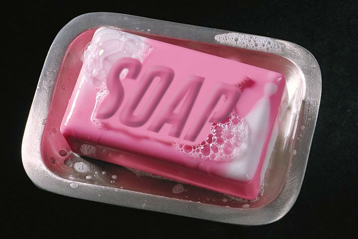

# :bathtub: Simple Soap
> The simple soap client


Simple soap is a simple abstraction of how every soap request should be



## :construction: Installation

Yarn:

```sh
yarn add simple-soap-js
```

Npm:

```sh
npm install simple-soap-js --save
```

## :tada: Usage example

```javascript
import Soap from 'simple-soap-js';

const soap = new Soap('https://www.starbucks.com')

const envelopeContent = `<clientName>Angel Face<clientName>`;

async function handleSoaRequest(){
  response = await soap.text('8thrule.asmx', envelopeContent);
  console.log(response)
}
```

_For more examples and usage, please refer to the [Wiki][wiki]._


## Release History

* 0.0.1
    * Work in progress

## Meta

C. Godri – [@godrizilla](https://twitter.com/godrizilla)

Distributed under the MIT license. See ``LICENSE`` for more information.

[https://github.com/godrix/simple-soap](https://github.com/godrix/simple-soap)

## Contributing

1. Fork it (<https://github.com/godrix/simple-soap/fork>)
2. Create your feature branch (`git checkout -b feature/fightClub`)
3. Commit your changes (`git commit -am 'You do not talk about Fight Club'`)
4. Push to the branch (`git push origin feature/fightClub`)
5. Create a new Pull Request

<!-- Markdown link & img dfn's -->
[npm-image]: https://img.shields.io/npm/v/datadog-metrics.svg?style=flat-square
[npm-url]: https://npmjs.org/package/datadog-metrics
[npm-downloads]: https://img.shields.io/npm/dm/datadog-metrics.svg?style=flat-square
[travis-image]: https://img.shields.io/travis/dbader/node-datadog-metrics/master.svg?style=flat-square
[travis-url]: https://travis-ci.org/dbader/node-datadog-metrics
[wiki]: https://github.com/yourname/yourproject/wiki